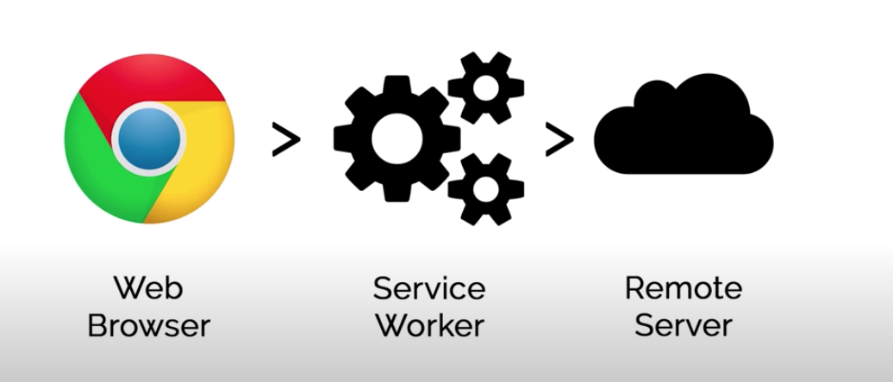

# Service workers
- It is mostly used for progressive web apps (PWA) i.e. App looks more like native apps
- It supports offline content loading
- it supports push notifications
- It supports background sync
- It is simply a javascript that gets registered with browser
- It stays registered with browser even when offline
- It can load content even with no connection

Normal request/response

With Service Workers

More about service workers
- They can't directly access the DOM
- They communicated with the parent pages using POST messages interface
- It has a programmable network proxy
- It terminated when not being used
- It does uses `Promise`
- Require `HTTPS` on server with exception on `localhost`

# Use cases
- Caching assets & API call
- Push notifications 
- Background data sync/preload 
- Used in progressive webapp
# Service Worker Lifecycle events

# Browser supports
- Now supported in all major browsers
- Most easily developed in Google chrome with dev tools

# Reference
https://www.youtube.com/watch?v=ksXwaWHCW6k&t=1695s
